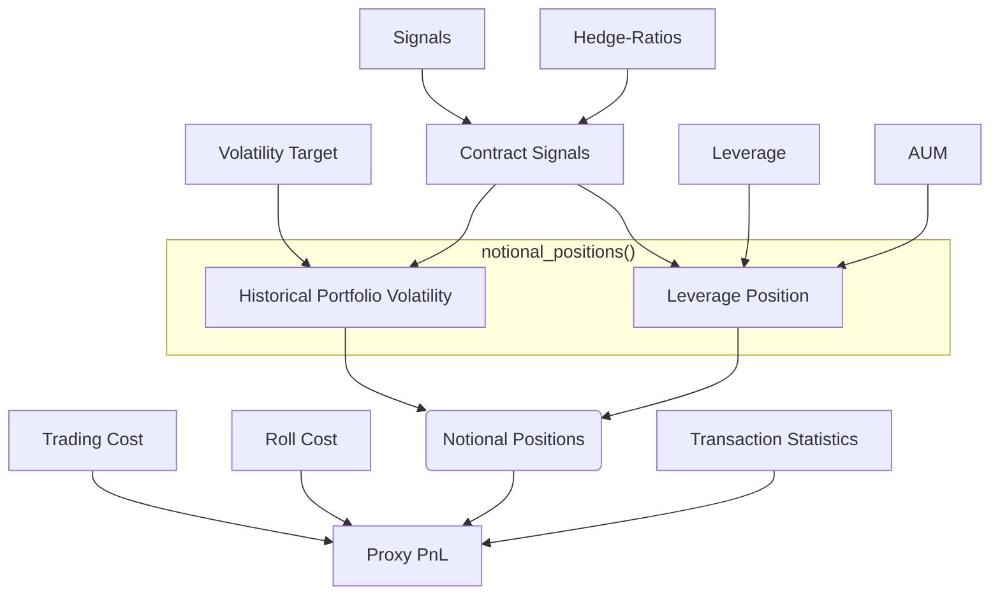

# `macrosynergy.download`

Subpackage for calculating Profits and Loss (PnL) of positions (portfolios).

## Naive PnL

The module `naive_pnl.py` is the entry point. It is run using the `NaivePnL` class. The class is designed to facilitate PnL estimation without taking into account position sizes, transaction costs, or leverage rules. It is a simple way to estimate PnLs to test out trading strategies or to illustrate the potential PnLs of a set of trading signals.

## Proxy PnL

With the entry point to this module being the `ProxyPnL` class, the purpose of this set of functions or class is to facilitate PnL estimation under the consideration of

1. assets under management (AUM),
2. volatility target or leverage rule,
3. transaction costs.

Like `NaivePnL` (in `naive_pnl.py`) this class works with a set of cross-section-specific signals and produces an illustrative PnL, but to consider position sizes and contract-specific transaction costs it proceeds differently.

In particular, the class allows proceeding in three separate steps, implemented through three different base methods:

- The method `contract_signals` transforms standard cross-sectional trading signals into notional contract-specific position signals. For example, if the raw signals refer to vol-targeted positions, the signals need to be inversely proportional to estimated volatility. Or if the signal refers to a hedged position with a hedge basket, the signal needs to be translated into positions for the main contract and all contracts that make up the hedging basket, in proportion to the hedge ratio and the basket shares (under consideration of potential contract blacklisting). Finally, the position signals need to be consolidated so that there is only one position signal per contract.

- The method `notional_positions` transforms contract signals into USD positions. This can be done with two principal methods. The first is to assign an AUM number and a leveraging rule. This means that the total sum of the positions is limited to a specified multiple of the set AUM. The second principal method targets the expected volatility of the portfolio based on the estimated volatility of the contract returns and their correlation. The second method will require an estimate_portfolio_vol function that estimates portfolio volatility based on contract sizes and historical returns.

- The method `proxy_pnl` multiplies positions with proxy returns and estimates transaction costs. In particular, it uses a trading_cost method to apply transaction costs and their size dependency to discretionary position changes. And it applies a roll_cost method to apply roll costs to positions at certain intervals. This function also should provide some analytics as to estimated PnLs across sections and the impact of trading costs.

### Flow

An example of a typical flow for using the `ProxyPnL` class is as follows:

